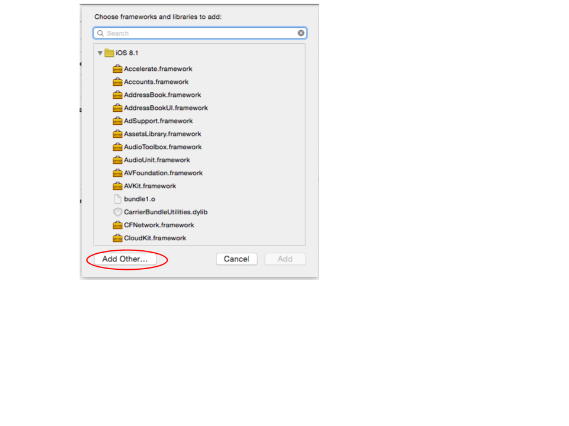
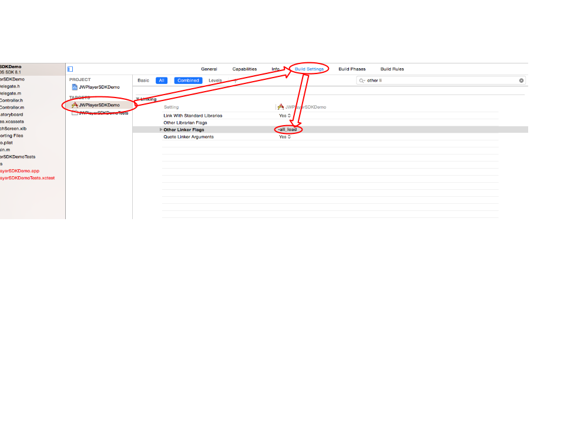
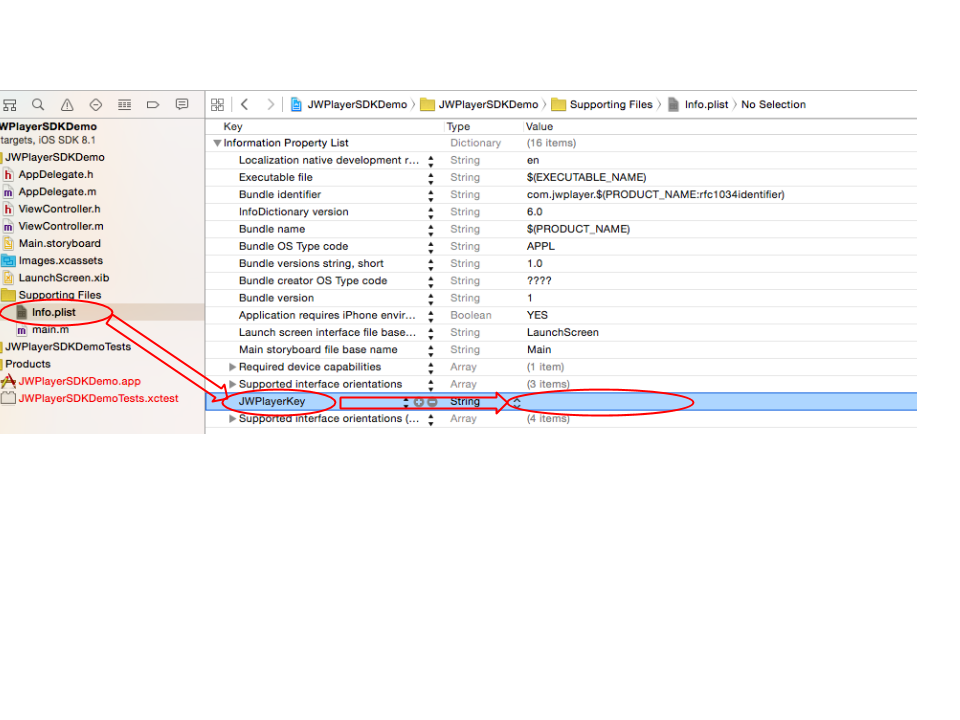
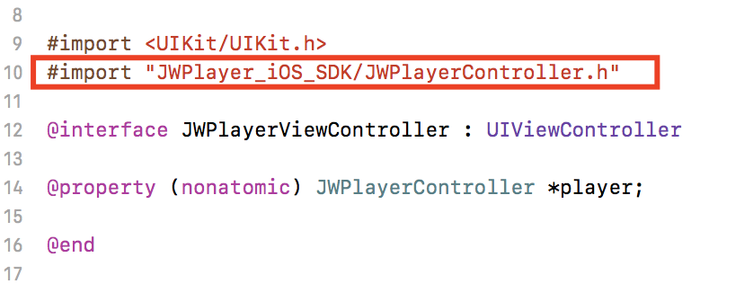
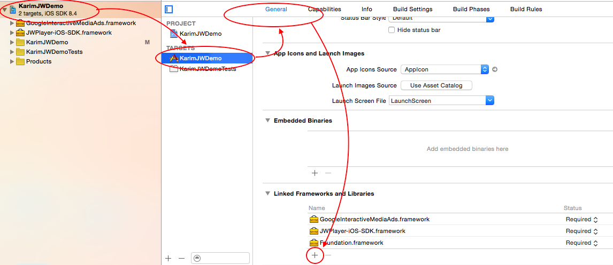
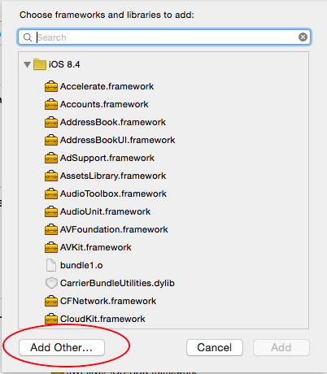

# Getting Started

## Downloading the SDK Software

1. Sign in to your JW Player dashboard at [https://dashboard.jwplayer.com](https://dashboard.jwplayer.com).
2. Browse to the **Publisher** -> **Tools** page.
3. In the **Downloads** section, click the JW Player SDK download link.

The unzipped package contains the following folders:

* **Framework**: The JW Player SDK software.  
* **Documentation**: inline API reference documentation for the JW Player framework for use in XCode.

### Oct 18, 2017
**Free, Premium, and Platinum edition** customers please note: the JW Player SDK for iOS will no longer be included in these editions beginning **OCT 18th 2018**. This provides our Free, Premium, and Platinum edition customers one (1) year to find an alternative to our SDK. Enterprise customers will continue to have access to the JW Player SDK for iOS and will not be impacted. Please contact support+sdk@jwplayer.com if you have additional questions.

## Setting up your XCode Environment

1. Add the JW Player framework to your XCode project

2. In the Build settings, add the **-all_load** linker flag

3. In your AppDelegate, set your your Player Key using the JWPlayerController's class method setPlayerKey: in the AppDelegate's application:didFinishLaunchingWithOptions: method. Make sure you enter this string exactly as you received it from JW Player, or as it appears in your JW Player Dashboard. The string is case-sensitive.

    - (BOOL)application:(UIApplication *)application didFinishLaunchingWithOptions:(NSDictionary *)launchOptions {
        [JWPlayerController setPlayerKey:@"YOUR_KEY_HERE"];
        return YES;
    }

Alternatively, In your **info.plist** properties file, create a string entry named **JWPlayerKey**, and set its value to be your JW Player Beta license key.

4. Import the **JWPlayerController.h** file into the viewController where you want to use the player. Alternately, you can import it in a .pch file to make it available across your whole project.

## Installing Google IMA

In order to use our Google IMA Ad Client, you must install the Google IMA framework version [3.7.0](https://developer.jwplayer.com/sdk/ios/docs/developer-guide/intro/requirements/). Visit https://developers.google.com/interactive-media-ads/docs/sdks/ios/download to download the Google IMA iOS SDK. The zip file contains two folders; you will need the Google IMA folder (GoogleInteractiveMediaAds-GoogleIMA3), **NOT** the Google IMA for Ad Mobs folder (GoogleInteractiveMediaAds-GoogleIMA3ForAdMob). 
To link the library, open XCode, select your project, and proceed to the Targets Section. Under the General tab, proceed to “Linked Framework and Libraries” and tap the plus sign. 

Select the “Add Other” button in the pop-up view and navigate to the Goole IMA SDK folder.

Select the GoogleInteractiveMediaAds.framework in the GoogleInteractiveMediaAds-GoogleIMA3 folder and select Open.

## Setting up using Cocoapods

Add pod 'JWPlayer-SDK', '~> 2.8' similar to the following to your Podfile:

    pod 'JWPlayer-SDK', '~> 2.8'

Then run a **pod install** inside your terminal, or from CocoaPods.app.
