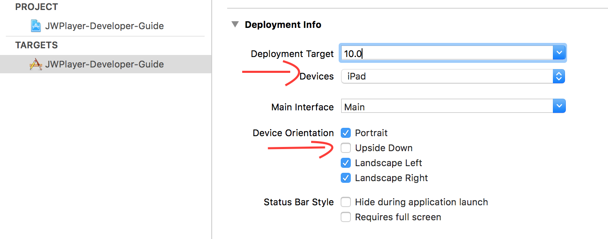

# Introduction

The JW Player SDK for iOS includes classes and methods to enable developers to add HLS and MP4 video playback functionality to iOS applications. The SDK also supports inclusion of VAST 3.0 video advertising in your applications, as well as reporting playback analytics to your JW Player dashboard, customizing video players using JW Player custom skins, and more.

The product also includes a demo application that you can install on your iOS device to illustrate the functionality that the SDK provides. 

## Oct 18, 2017

**Free, Premium, and Platinum edition** customers please note: the JW Player SDK for iOS will no longer be included in these editions beginning **OCT 18th 2018**. This provides our Free, Premium, and Platinum edition customers one (1) year to find an alternative to our SDK. Enterprise customers will continue to have access to the JW Player SDK for iOS and will not be impacted. Please contact support+sdk@jwplayer.com if you have additional questions.

## Supported Features
The JW Player SDK for iOS supports all the features of the JW Player Ads Edition for web, with the following **exceptions**:

* RTMP streaming  
* Playback of FLV, Vorbis or WebM formats  
* Google Analytics    
* Adobe SiteCatalyst  
* YouTube integration  
* VPAID 1.0 ads  

## Known issues
* We do not support Picture in Picture representation for ads played using Google IMA.
* Unintended behavior may appear during Fullscreen on iPad devices if upside down orientation is enabled. For optimal behavior please disable the upside down device orientation.

For more information about JW Player Ads Edition features, see [http://support.jwplayer.com/customer/portal/articles/1403727-what-is-jw-player-](http://support.jwplayer.com/customer/portal/articles/1403727-what-is-jw-player-)

## Intended Audience
This guide assumes that you have the necessary Objective C or Swift and iOS development skills to build and compile advanced iOS applications using XCode. It also assumes that you are familiar with online media technologies such as Apple HTTP Live Streaming (HLS), MP4, and H.264/AAC.
